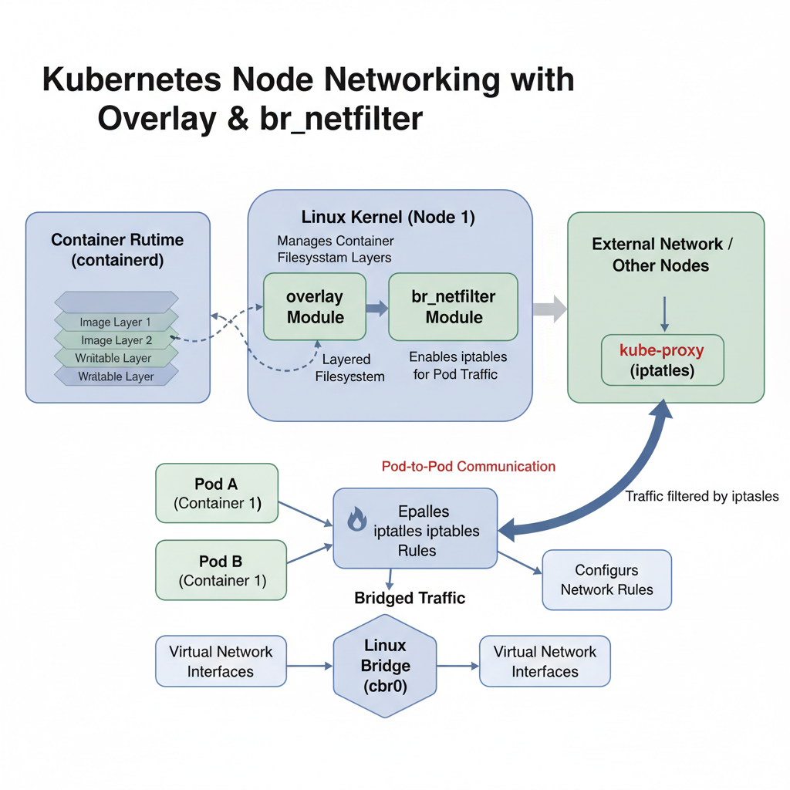
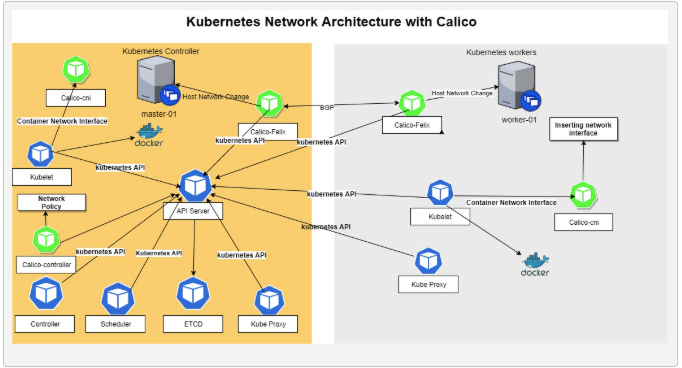

## Building Your Cluster

1. Install and configure packages required for Kubernetes (containerd, kubeadm, kubelet, kubectl)
2. Create your cluster
3. Configure Pod networking
4. Join nodes to your cluster

`kubelet` is a thing that will drive the work on each node and in our cluster.
`kubeadm` is respionsible for creating and managing the cluster up/running and configured. It also helps with upgrades and joining nodes.
`kubectl` is the primary CLI tool to interact with your cluster.
`containerd` pulls images from registries. Stores and organizes them on the server. It starts, stops and deletes containers.

## Topology

For this course, we will be using a simple topology with 1 control plane node and 2 worker nodes.
We are using Ubuntu 22.04 VMs with 1 vCPU, 1GB RAM and 20GB disk each.
Swap is disabled on all nodes. -- Swap space is a designated area on a HDD/SSD that an operating system uses as virtual memory. This can interfere with kubelet operations.
Hostnames and IPs are set and host file on each node.
```
        +---------------------+
        |   Control Plane      |
        |   (kubeadm init).    |
        |.  Hostname: c1-cp1   |
        |   IP: 10.0.0.9      |
        +---------------------+
                   |
                   |
        +---------------------+
        |     Worker Node 1   |
        |   (kubeadm join)    |
        |.   Hostname: c1-node1 |
        |   IP: 10.0.0.10     | 
        +---------------------+
```

## Prerequisites

**VMs:**

1. I created a Virtual Cloud Network with a public subnet in the London region. I added in Internet Gateway and the Default Route Table.
2. Also, I needed a security List allowing SSH (22) and all traffic and Network Security Group allowing SSH (22) and all traffic.
3. I created 2 VMs in the public subnet using the Ubuntu 24.04 image.

**Memory:**

``` bash
# Disabling `swap` ensures that the kubelet has a clear, real-time view of a node's memory resources, leading to more predictable performance and more reliable scheduling.
# Disable swap with swapoff -a
# Permanently disable swap by editing /etc/fstab and commenting out any swap entries.
# Check if it is disabled
sudo swapoff -a
vi /etc/fstab
free -h
```

**Networking:**

Configure the containerd prerequisite, and load two modules and configure them to load on boot.

`overlay`: is a filesystem driver that allows different layers of a container image to be stacked on top of each other efficiently. This is how container runtimes like `containerd` manage images.

`br_netfilter`: is required to enable communication between pods by allowing `iptables` rules to filter and route bridge network traffic. Without it your pods wouldn't be able to talk to each other. 



```bash
# By creating the file and adding the kernel modules, we ensure that they load automatically on system boot, which is essential for the proper functioning of containerd and Kubernetes networking.
cat <<EOF | sudo tee /etc/modules-load.d/k8s.conf
br_netfilter
overlay
EOF

# Load the modules for the current session, so no need to reboot the server
sudo modprobe br_netfilter
sudo modprobe overlay
```

Need the `sysctl` params to enable networking routing for the Kubernetes cluster.

`net.bridge.*`: commands needed to enable `iptables` rules to filter and route bridge network traffic. In a Kubernetes cluster, pods communicate over a virtual network bridge (e.g. cbr0). Wihtout these settings, `iptables` rules, which are used for Kubernetes network policies and service routing, would not function correctly.

The `net.ipv4.ip_forward` setting is crucial for enabling IP forwarding on the node. This allows the node to route packets between different network interfaces, which is essential for pod-to-pod communication across nodes in a Kubernetes cluster.

```bash
cat <<EOF | sudo tee /etc/sysctl.d/k8s.conf
net.bridge.bridge-nf-call-iptables  = 1
net.bridge.bridge-nf-call-ip6tables = 1
net.ipv4.ip_forward                 = 1
EOF

# Load them into memory by running:
sudo sysctl --system
```

---

## Install Kubernetes components

1. containerd
2. kubelet
3. kubeadm
4. kubectl 

```bash
# Install containerd
sudo apt-get update && sudo apt-get install -y containerd

# Create the default configuration file for `containerd`... - to make sure container runtime functional out of the box
sudo mkdir -p /etc/containerd
sudo containerd config default | sudo tee /etc/containerd/config.toml
```

You need to load the `SystemdCgroup` driver by enabling it in the config file. In the `/etc/containerd/config.toml` file, find the `SystemdCgroup` setting and set it to `true`.

Then restart `containerd` to apply the changes.

```bash
sudo systemctl restart containerd
```

Add the Kubernetes apt repository and the GPG key.

1. Purpose of a GPG Key: A GPG key is used to verify the authenticity and integrity of packages. It ensures that the packages you install come from a trusted source and have not been tampered with.
2. `apt-transport-https`: is a package that allows the use of repositories accessed via the HTTP Secure protocol (HTTPS). This is important for securely downloading packages and updates from remote repositories.
3. `ca-certificates`: is a package that contains the common CA (Certificate Authority) certificates used to verify the authenticity of SSL/TLS connections. It is essential for establishing secure connections to HTTPS repositories.
4. `gpg --dearmor -o /etc/apt/keyrings/kubernetes-archive-keyring.gpg`: This command converts the ASCII-armored GPG key into a binary format and saves it to the specified location. This is necessary for apt to use the key for package verification.
5. `echo "deb [signed-by=/etc/apt/keyrings/kubernetes-archive-keyring.gpg] https://apt.kubernetes.io/ kubernetes-xenial main" | sudo tee /etc/apt/sources.list.d/kubernetes.list`: This command adds the Kubernetes apt repository to the system's package sources, allowing you to install Kubernetes packages from this repository.

```bash
# First for the available version you can check the website or use the command below:
apt-cache madison kubeadm
apt-cache madison kubelet
apt-cache madison kubectl

sudo apt-get update && sudo apt-get install -y apt-transport-https ca-certificates curl gpg
sudo curl -fsSL https://pkgs.k8s.io/core:/stable:/v1.29/deb/Release.key | sudo gpg --dearmor -o /etc/apt/keyrings/kubernetes-apt-keyring.gpg
sudo chmod 644 /etc/apt/keyrings/kubernetes-apt-keyring.gpg
echo "deb [signed-by=/etc/apt/keyrings/kubernetes-apt-keyring.gpg] https://pkgs.k8s.io/core:/stable:/v1.29/deb/ /" | sudo tee /etc/apt/sources.list.d/kubernetes.list
sudo chmod 644 /etc/apt/sources.list.d/kubernetes.list
sudo apt-get update
```

### Install `kubelet`, `kubeadm` and `kubectl`

```bash
VERSION=1.33.1-1.1
sudo apt-get install -y kubelet=$VERSION kubeadm=$VERSION kubectl=$VERSION
sudo apt-mark hold kubelet kubeadm kubectl
```

Check the `systemd` units e.g. `kubelet` and `containerd` are enabled and running.

```bash
sudo systemctl status kubelet.service
sudo systemctl status containerd.service
```

## Network Connectivity

I used Calico for Pod networking. Calico is a popular open-source networking and network security solution for containers, virtual machines, and native host-based workloads. It is widely used in Kubernetes environments to provide networking capabilities for pods.

Basically Calico answers these questions:
1. How do pods on different nodes communicate with each other?
2. How do pods get IP addresses?
3. How is network security enforced between pods?
4. Who is allowed to talk to whom?

Calico network policy enforcement is done using `iptables` rules on each node. Calico translates high-level policies (e.g. "Pod A can only talk to Pod B on port 80") into low-level `iptables` rules.



```bash
# On the control plane node only download the yaml files for the pod network 
wget https://raw.githubusercontent.com/projectcalico/calico/master/manifests/calico.yaml

#Changed the Pod Network IP address range CALICO_IPV4POOL_CIDR in the calico.yaml file to 10.0.0.0/16 
# to ensure that the Pod network IP range doesn't overlap with other networks in our infrastructure.
```

## Initialize the Control Plane Node (bootstrap the cluster)

On the control plane node only, run `kubeadm init` to initialize the cluster.

```bash
sudo kubeadm init --kubernetes-version=v1.33.0 --pod-network-cidr=10.0.0.0/16 #or your CIDR and version

#Configure our account on the Control Plane node to have admin access to the API server from a non-privileged account.
mkdir -p $HOME/.kube
sudo cp -i /etc/kubernetes/admin.conf $HOME/.kube/config
sudo chown $(id -u):$(id -g) $HOME/.kube/config
```

**Creating a Pod Network**

```bash
#For the usefule kubectl commands, see the file kubectl_commands_cheatsheet.md

kubectl apply -f calico.yaml
kubectl get pods --all-namespaces
```

## Things to check on the Control Plane node

```bash
# Check the nodes
kubectl get nodes

# Check the systemd services - it should be active and running
# The kubelet starts the static pods (etcd, kube-apiserver, kube-controller-manager, kube-scheduler) on the control plane node.
sudo systemctl status kubelet

# Check out the directory where the kubeconfig file is located
ls -l /etc/kubernetes/

# Check the status pod manifest files
ls /etc/kubernetes/manifests

# Check the API server and etcd manifest files
cat /etc/kubernetes/manifests/kube-apiserver.yaml
cat /etc/kubernetes/manifests/etcd.yaml

