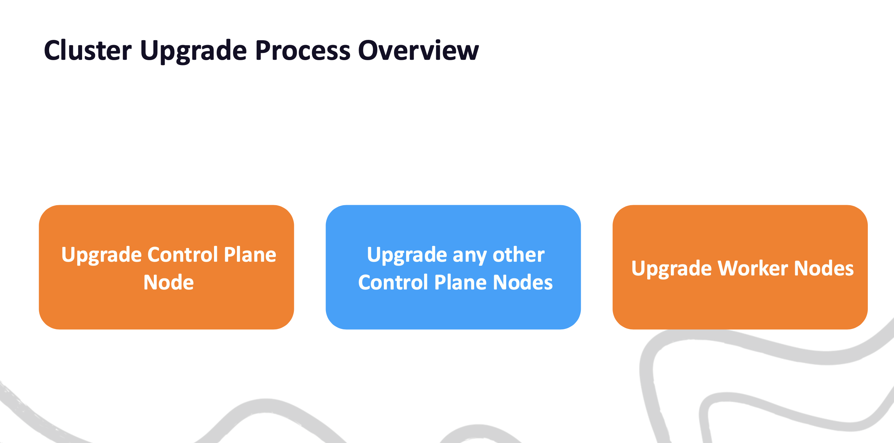
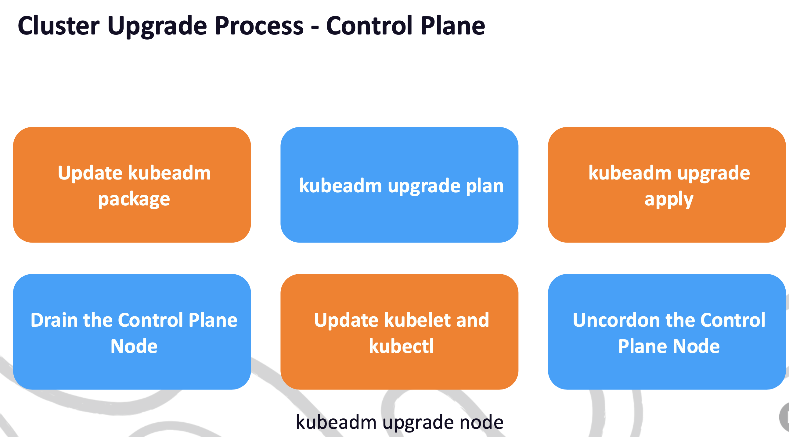
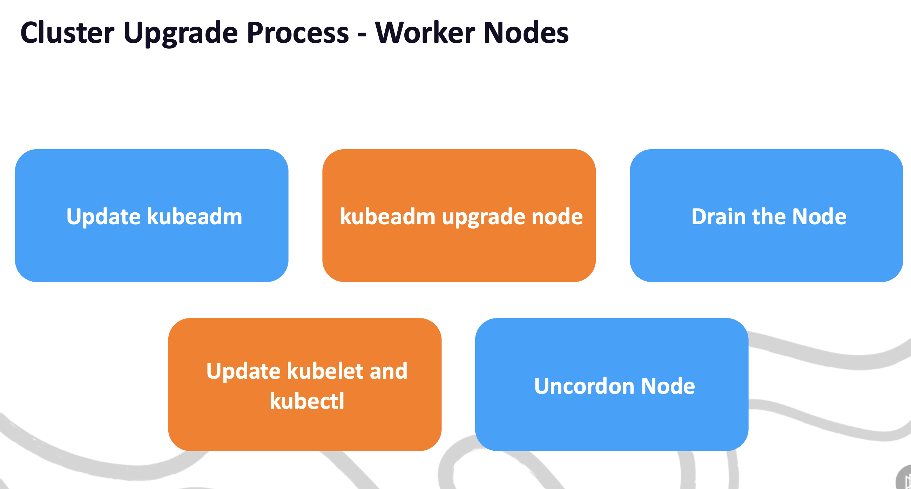

# Upgrade the Cluster

<u>First you need to upgrade the control plane node, then the worker nodes.</u>


## Upgrade the Control Plane Node



**Upgrade kubeadm**

Find the version you want to upgrade the `kubeadm` to and upgrade it.

```bash
sudo apt-get update && apt-cache policy kubeadm
TARGET_VERSION=<VERSION_STRING>

sudo apt-mark unhold kubeadm && sudo apt-get install -y kubdeadm=$TARGET_VERSION
sudo apt-mark hold kubeadm
```

**Verify the upgrade plan**

Run the upgrade plan to see what will be upgraded. and check the pre-flight checks.

```bash
sudo kubeadm upgrade plan
```

**Run the upgrade**

1. It runs pre-flight checks - API availability, Node status Ready and control plane health.
2. Checks to ensure you are upgrading along the correct upgrade path. 
3. Prepulls container images to reduce downtime of control plane components.
    3.1 Updates the certificates used for authentication
    3.2 Creates a new static pod manifest in `/etc/kubernetes/manifests` and saves the old one to `/etc/kubernetes/tmp`
4. Updates the Control Plane Node's kubelet configuration and also updates CoreDNS and kube-proxy.

```bash
sudo kubeadm upgrade apply $TARGET_VERSION
```

**Drain any workload from the Control Plane Node**

`kubectl drain <control-plane-node-name> --ignore-daemonsets`

**Upgrade kubelet and kubectl**

```bash
sudo apt-mark unhold kubelet kubectl && sudo apt-get install -y kubelet=$TARGET_VERSION kubectl=$TARGET_VERSION
sudo apt-mark hold kubelet kubectl
```

**Reload and restart the systemd unit**

```bash
sudo systemctl daemon-reload
sudo systemctl restart kubelet
sudo systemctl status kubelet
```

**Uncordon the Control Plane Node**
This will allow scheduling of workloads on the control plane node.

`kubectl uncordon <control-plane-node-name>`

---

## Upgrade the Worker Nodes



**Drain the Worker Node**

This will evict all the workloads from the worker node and mark it unschedulable.
`kubectl drain <worker-node-name> --ignore-daemonsets`

**Upgrade kubeadm**

```bash
sudo apt-mark unhold kubeadm && sudo apt-get install -y kubeadm=$TARGET_VERSION
sudo apt-mark hold kubeadm
```

**Run the upgrade**

`sudo kubeadm upgrade node`
This will update the kubelet configuration and also update the kube-proxy DaemonSet.

**Upgrade kubelet and kubectl**

```bash
sudo apt-mark unhold kubelet kubectl && sudo apt-get install -y kubelet=$TARGET_VERSION kubectl=$TARGET_VERSION
sudo apt-mark hold kubelet kubectl
```

**Reload and restart the systemd unit**

```bash
sudo systemctl daemon-reload
sudo systemctl restart kubelet
sudo systemctl status kubelet
```

**Uncordon the Worker Node**

This will allow scheduling of workloads on the worker node.

`kubectl uncordon <worker-node-name>`