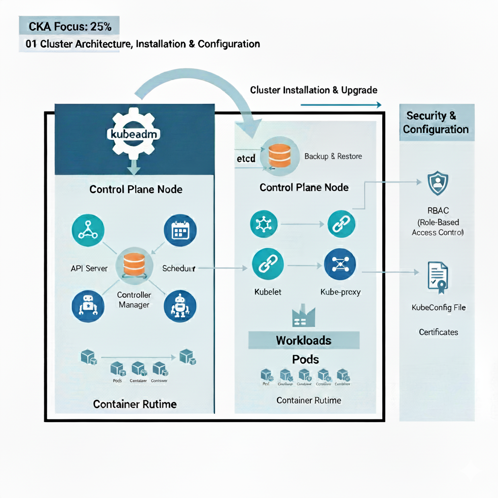

# 01: Cluster Architecture, Installation & Configuration (CKA Weight: 25%)

This section of the CKA preparation covers the foundational elements of a Kubernetes cluster, including how to set up, maintain, and secure it. Mastery of these topics is crucial as they form the bedrock of all other Kubernetes operations.

## 🎯 Key Learning Objectives for this Domain

* Understand the core components of a Kubernetes cluster (Control Plane vs. Worker Nodes).
* Install and configure a Kubernetes cluster using `kubeadm`.
* Perform cluster upgrades with `kubeadm`.
* Manage `etcd` backups and restores.
* Configure Role-Based Access Control (RBAC) for users and service accounts.
* Understand and manage various Kubernetes certificate components.
* Configure `kubeconfig` files.

## 🧠 Core Concepts & Components

* **Control Plane Components:**
    * **kube-apiserver:** The front-end for the Kubernetes control plane.
    * **etcd:** Consistent and highly-available key-value store used as Kubernetes' backing store for all cluster data.
    * **kube-scheduler:** Watches for newly created Pods with no assigned node, and selects a node for them to run on.
    * **kube-controller-manager:** Runs controller processes (Node, Replication, Endpoints, Service Accounts, Token).
* **Worker Node Components:**
    * **kubelet:** An agent that runs on each node in the cluster. Ensures containers are running in a Pod.
    * **kube-proxy:** Network proxy for Services.
    * **Container Runtime:** Software to run containers (e.g., containerd, CRI-O).
* **Cluster Installation:** `kubeadm` for bootstrapping clusters.
* **Cluster Upgrades:** `kubeadm upgrade` process (drain, upgrade control plane, upgrade kubelets).
* **Backup & Restore:** `etcdctl snapshot` for `etcd` data management.
* **Security:** RBAC (Roles, ClusterRoles, RoleBindings, ClusterRoleBindings), Service Accounts, Pod Security Standards (PSS - though less direct config on CKA now).
* **Certificates:** Understanding their role and management within the cluster.

## 💡 Important Commands & Tips

* **`kubeadm`:**
    * `kubeadm init`
    * `kubeadm join`
    * `kubeadm upgrade plan`
    * `kubeadm upgrade apply`
    * `kubeadm token create`
    * `kubeadm reset`
* **`etcdctl`:**
    * `ETCDCTL_API=3 etcdctl snapshot save <FILE_NAME>`
    * `ETCDCTL_API=3 etcdctl snapshot restore <FILE_NAME>`
    * Remember `--data-dir` for restore!
* **`kubectl` for RBAC:**
    * `kubectl create role/clusterrole ...`
    * `kubectl create rolebinding/clusterrolebinding ...`
    * `kubectl get role/clusterrole/rolebinding/clusterrolebinding`
    * `kubectl auth can-i ...` (crucial for troubleshooting RBAC)
* **Files & Paths:**
    * `/etc/kubernetes/manifests` (static pods for control plane components)
    * `/etc/kubernetes/pki` (certificates)
    * `/etc/kubernetes/admin.conf` (kubeconfig for cluster admin)
* **Troubleshooting:** Always check `systemctl status <component>`, `journalctl -u <component>`, and logs of control plane static pods.

## 📂 Repository Contents for this Domain

* [`etcd_backup_restore/`](etcd_backup_restore/): Scripts and notes for `etcd` backup and restore operations.
* [`cluster_upgrades/`](cluster_upgrades/): Documentation on `kubeadm` upgrade processes and common pitfalls.
* [`rbac.yaml`](rbac.yaml): Example YAML manifests for various RBAC scenarios (Roles, RoleBindings, ClusterRoles, ClusterRoleBindings).

---

