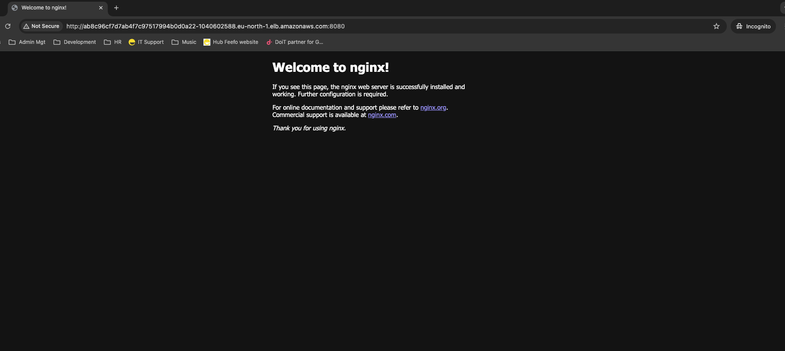

# 🚧 Issue: LoadBalancer Service Stuck in `<pending>` on AWS

## 📝 Problem Description

After deploying a Kubernetes **Service of type** `LoadBalancer` on a self-managed `kubeadm` cluster running on AWS EC2 VMs, the service remained in the `<pending>` state. This indicated that the Kubernetes Control Plane could not communicate with the AWS API to provision an Elastic Load Balancer (ELB).

Initial attempts to manually enable the deprecated in-tree cloud provider (`--cloud-provider=aws`) caused the core control plane Pods to crash (e.g., `kube-controller-manager` failed to start).

## 🛠️ Root Cause Analysis

The failure was due to the cluster running a modern Kubernetes version (v1.21+), which has deprecated and disabled the legacy "in-tree" cloud provider integration. The cluster needed to be fully migrated to the Out-of-Tree (External) Cloud Controller Manager (CCM) model.

The necessary prerequisites and steps were:

1. **Cloud Provider Flag Mismatch:** Core components were misconfigured, causing the kube-controller-manager to crash upon restart.
2. **Missing External Controller:** The cluster lacked the dedicated AWS software required to call the AWS API.
3. **AWS Permissions:** The underlying EC2 instances lacked the necessary IAM permissions and Subnet Tags required by the external controller.

---

## ✅ Resolution Steps

The cluster was successfully configured for external load balancing by performing the following two phases:

### Phase 1: Enable External Cloud Provider (Stabilization)

This step instructed the Kubernetes core components to delegate cloud responsibilities.

1. **Update Kube-Controller-Manager (Control Plane only):**
    - The `kube-controller-manager.yaml` static manifest (located at `/etc/kubernetes/manifests/kube-controller-manager.yaml` on the Control Plane node) was edited.
    - The deprecated `--cloud-provider=aws` flag was removed.
    - The new `--cloud-provider=external` flag was added to the container command arguments.
2. **Update Kubelet Configuration (All Nodes):**
    - The Kubelet configuration file (e.g., `/var/lib/kubelet/kubeadm-flags.env` on all nodes) was edited.
    - The flag `--cloud-provider=external` was appended to `the KUBELET_KUBEADM_ARGS` environment variable.
3. **Apply Changes to Systemd:**
    - The system daemon was reloaded and the Kubelet was restarted on all nodes for the changes to take effect:

    ```bash
    sudo systemctl daemon-reload
    sudo systemctl restart kubelet
    ```

### Phase 2: Deploy External AWS Cloud Controller Manager (Automation)

The dedicated AWS logic was installed via Helm to handle the LoadBalancer requests.

1. **Install Helm:** Helm was installed on the Control Plane node to manage the deployment.
2. **Deploy the AWS Cloud Controller Manager:** The official Helm chart was used to deploy the CCM to the `kube-system` namespace. This single operation correctly deployed several critical resources:
    - **DaemonSet:** The core controller Pods that execute the AWS API calls.
    - **Service Account, ClusterRole, and Bindings:** These grant the controller Pods the necessary RBAC permissions within Kubernetes.
3.  **Initial CCM log discovery:** The CCM Pod logs indicated a missing argument. The full command arguments needed to include the **VPC CIDR block**.
4.  **Missing Argument:** `- --cloud-cidr=[MY_VPC_CIDR_BLOCK]` was added to the Helm chart values and the chart was re-deployed to include this argument.
5. **Final Prerequisites Check (AWS Side):** The successful deployment relied on the earlier configuration of:
    - **IAM Role:** A role with ElasticLoadBalancingFullAccess and AmazonEC2FullAccess was attached to all EC2 instances.
    - **Subnet Tags:** Public subnets were tagged with `kubernetes.io/cluster/kubernetes: owned` and `kubernetes.io/role/elb: 1`.

**External AWS Cloud Controller Manager Helm Chart:** https://github.com/kubernetes/cloud-provider-aws/tree/master/charts/aws-cloud-controller-manager

Once the CCM Pods were running with the correct `--cloud-cidr` flag, the previously pending Service object was reconciled, and the AWS Network Load Balancer was provisioned, receiving an **external-IP/DNS**.

### Final Adjustment: Manually Register EC2 Instances

Even after the Service received an external address, traffic was not being routed. Upon inspection, the Load Balancer was provisioned, but the **target worker EC2 instances were not automatically registered** in the target group.

**Manual Step:** In the AWS Console, the healthy EC2 worker instances were manually assigned to the Load Balancer's target group.

After this final manual registration, the service was fully functional: 