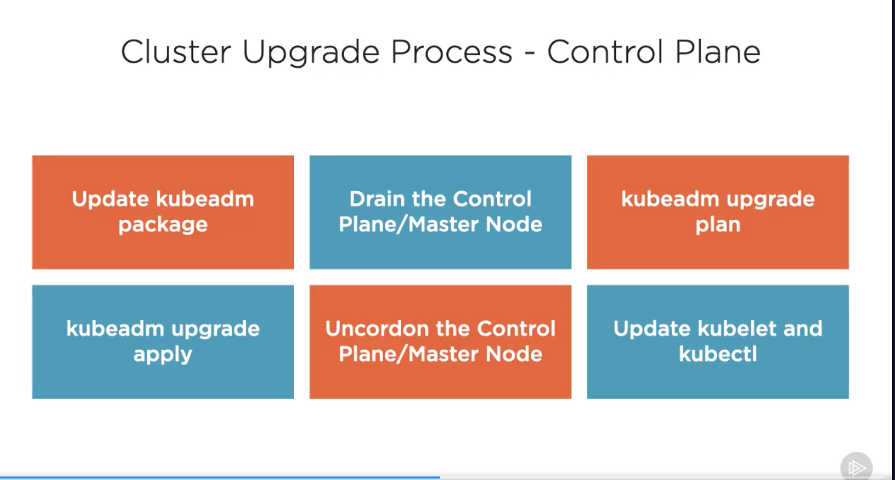

## 🏁 Using `kubeadm` to install a Basic Cluster

```bash
#0 - Install Packages
#containerd prerequisites, and load two modules and configure them to load on boot
cat << EOF | sudo tee /etc/modules-load.d/k8s.conf
overlay
br_netfilter
EOF

sudo modprobe overlay
sudo modprobe br_netfilter

# sysctl params required by setup, params persist across reboots
cat <<EOF | sudo tee /etc/sysctl.d/k8s.conf
net.bridge.bridge-nf-call-iptables = 1
net.bridge.bridge-nf-call-ip6tables = 1
net.ipv4.ip_forward = 1
EOF

# Apply sysctl params without reboot
sudo sysctl --system

# Install containerd...
sudo apt-get install -y containerd

# Create a containrd configuration file
sudo mkdir -p /etc/containerd
sudo containerd config default | sudo tee /etc/containerd/config.toml #this will generate the config file

# Set the cgroup driver for containerd to systemd which is required for the kubelet
# You can sed to swap in true
sudo sed -i 's/ SystemCgroup = false/   SystemCgroup = true/' /etc/containerd/config.toml

# Verify the change was made
grep 'SystemdCgroup = true' /etc/containerd/config.toml

# Restart containerd with the new configuration
sudo systemctl restart containerd


# Install Kubernetes packages - kubeadm, kubelet and kubectl
sudo apt-get install -y apt-transport-https ca-certificates curl gpg
sudo curl -fsSL https://pkgs.k8s.io/core:/stable:/v1.29/deb/Release.key | sudo gpg --dearmor -o /etc/apt/keyrings/kubernetes-apt-keyring.gpg

# Add the Kubernetes apt repository
echo 'deb [signed-by=/etc/apt/keyrings/kubernetes-apt-keyring.gpg] https://pkgs.k8s.io/core:/stable:/v1.29/deb/ /' | sudo tee /etc/apt/sources.list.d/kubernetes.list

# Update the package list and use apt-cache policy to inspect versions available in the repo
sudo apt-get update
apt-cache policy kubelet | head -n 20 # to see the versions

# Install the required packages,if needed we can request a specific version
VERSION=1.29.1-1.1
sudo apt-get install -y kubelet=$VERSION kubeadm=$VERSION kubectl=$VERSION
sudo apt-mark hold kubelet kubeadm kubectl containerd

#1 - systemd Units
# Check the status of our kubelet and our container runtime, containerd
# The kubelet will enter a inactive (dead) state until a cluster is created or the node is joined to an existing cluster
sudo systemctl status kubelet.service
sudo systemctl status containerd.service 

##############################
##############################

# Bootstrapping a Cluster with kubeadm - Control Plane Node
# Create our kubernetes cluster, specify a pod network range matching that in calico.yaml
# Only on the Control Plane Node, download the yaml files for the pod network 
wget http://raw.githubusercontent.com/projectcalico/calico/master/manifests/calico.yaml

# Look inside calico.yaml and find the setting for Pod Network IP adderss range CALICO_IPV4POOL_CIDR
# adjust if needed for the infrastructure to ensure that the Pod network IP
# range doesn't overlap with other networks in our infra
vi calico.yaml

# Bootstrap the cluster 
sudo kubeadm init --kubernetes-version v1.29.1

# Configure our account on the Control Plane Node to have admin access to the API server from a non-priviliged account
mkdir -p $HOME/.kube
sudo cp -i /etc/kubernetes/admin.conf $HOME/.kube/config
sudo chown $(id -u):$(id -g) $HOME/.kube/config

#1 - Creating a Pod Network
kubectl apply -f calico.yaml

# Look for all the system pods and calico pods to change to Running
# The DNS pod won't start (pending) until the Pod network is deployed and Running
kubectl get pods --all-namespaces

# Get a list of our current Nodes, just the Control Plane Node .. should be Ready. 
kubectl get nodes

#2 - systemd Units
# Check out the systemd unit...it's no longer inactive (dead) ..its active(running) because it has static pods to start
# the kubelet starts the static pods, and thus the control plane pods
sudo systemctl status kubelet.service

#3 - Static Pod manifests
#Let's check out the static pod manifests on the Control Plane Node
ls /etc/kubernetes/manifests

# And look more closely at API server and etcd's manifest
sudo more /etc/kubernetes/manifests/etcd.yaml
sudo more /etc/kubernetes/manifests/kube-apiserver.yaml

# Check out the directory where the kubeconfig files live for each of the control plane pods
ls /etc/kubernetes
```

---

## ⛓️‍💥 Join Nodes to the Cluster `kubeadm join`

```bash
#On the node disable swap, swapoff then edit your fstab removing any entry for swap partitions
#You can recover the space with fdisk. You may want to reboot to ensure your config is ok
swapoff -a
vi /etc/fstab

###
#0 Joining the Nodes to the CLuster 
# Install the container runtime - containerd
# containerd prerequisites, and load two modules and configure them to load on boot
cat <<EOF | sudo tee /etc/modules-load.d/k8s.conf
overlay
br_netfilter
EOF

sudo modprobe overlay
sudo modprobe br_netfilter

#sysctl params reuired by setup, params persist across reboots
cat <<EOF | sudo tee /etc/sysctl.d/k8s.conf
net.bridge.bridge-nf-call-iptables = 1
net.bridge.bridge-nf-call-ip4tables = 1
net.ipv4.ip_forward = 1
EOF

# Apply sysctl params without reboot
sudo sysctl --system

# Install containerd - now that we have the base OS configured
sudo apt-get install -y containerd

#Configure containerd and generate containerd config file
sudo mkdir -p /etc/containerd
sudo containerd config default | sudo tee /etc/containerd/config.toml

#Change SystemdCgroup = false to SystemdCgroup = true
# You can use sed to swap in true
sudo sed -i 's/ SystemdCgroup = false/ SystemdCgroup = true/' /etc/containerd/config.toml

#Verify the change was made
grep 'SystemdCgroup = true' /etc/containerd/config.toml

#Restart containerd with the new configuration
sudo systemctl restart containerd


#Install Kubernetes packages - kubeadm, kubelet and kubectl
#Add Google's apt repository gpg key
sudo apt-get install -y apt-transport-https ca-certificates curl gpg
sudo curl -fsSL https://pkgs.k8s.io/core:/stable:/v1.29/deb/Release.key | sudo gpg --dearmor -o /etc/apt/keyrings/kubernetes-apt-keyring.gpg

#Add the Kubernetes apt repo
echo "deb [signed-by=/etc/apt/keyrings/kubernetes-apt-keyring.gpg] https://pkgs.k8s.io/core:/stable:/v1.29/deb/ /" | sudo tee /etc/apt/sources.list.d/kubernetes.list

#Updade the package list and use apt-cache policy to inspect versions available in the repo
sudo apt-get update
apt-cache policy kubelet | head -n 20


#INstall the required packages, if needed we can request a specific version
VERSION=1.29.1-1.1
sudo apt-get install -y kubelet=$VERSION kubeadm=$VERSION kubectl=$VERSION
sudo apt-mark hold kubelet kubeadm kubectl containerd

#Check the status of our kubelet and container runtime
#The kubelet will enter an inactive/dead state until it's joined
sudo systemctl status kubelet.service
sudo systemctl status containerd.service


### Log out from the Node & log back to the Cluster

#You can also use print-join-command to generate token and print the join command in the proper format
# COPY THIS INTO YOUR CLIPBOARD
kubeadm token create --print-join-command

###
#ssh back to the Node
#PASTE_JOIN_COMMAND_HERE be sure to add sudo
sudo kubeadm join 10.154.0.12:6443 --token cwm3vc.guwlbmfytmdc555b --discovery-token-ca-cert-hash sha256:39533dca7f9fd684cc63aae278085c082a2e71670408fbad3b55facaaad3b262


###
# Make sure the Node VM can reach the Cluster VM 
nc -vz [CLUSTER_IP_ADDRESS] 6443
# Create and add Firewall rules
# Cluster = Allow | tcp:6443 | 0.0.0.0/0  
# Node = Allow | tcp,udp,icmp | YOUR VPC CIDR range

# Make sure the IP_FORWARD is enabled on the Node VM
# /etc/sysctl.conf | net.ipv4.ip_forward = 1
# /proc/sys/net/ipv4/ip_forward = 1
echo 1 | sudo tee /proc/sys/net/ipv4/ip_forward 


# Back on the Control Plane Node, check the status of the node
kubectl get nodes

#Watch for the calico and the kube-proxy to change to Running on the newly added nodes
kubectl get pods --all-namespaces --watch
```

---

## ⌂ Useful `kubectl` Commands



```bash
#Create resources
kubectl apply/create

#Start a pod from an image
kubectl run

#Show documentation for API resources
kubectl explain

#Explain an individual resource in details
kubectl explain pod | more
kubectl explain pod.spec | more
kubectl explain pod.spec.containers | more
kubectl explain pod --recursive | more

#Delete
kubectl delete

#List
kubectl get

#List everything that is running in all namespaces and pipe more so can see by page
#like services, daemonsets, deployments and replicasets
kubectl get all -all-namespaces | more

#List everything -- all the resources that Kubernete knows about
# See the shortcuts for the objects
kubectl api-resources | more

#Detailed resource information
kubectl describe

#Describe the details of the Node
kubectl describe nodes c1-cp1 | more

#Execute a command on a container
kubectl exec

#View logs on a container
kubectl logs

###
#Modify kubectl`s output format
--output=
#ouput additional info
-wide 

#YAML formatted API object
-yaml

#JSON formatted API object
-json

#print an object without sending it to the API server
-dry-run

#Use -h or --help to find help
kubectl -h | more
kubectl create -h | more

#bash-autocomplete of our kubectl commands
sudo apt-get install -y bash-completion
echo "source <(kubectl completion bash)" >> ~/.bashrc
source ~/.bashrc


#When containerd is your container runtime, use crictl to get a listing of the containers running
sudo crictl --runtime-endpoint unix:///run/containerd/containerd.sock ps

#Starting a process inside a container inside a pod
#We can use this to launch any process as long as the executable/binary is in the container
#This is on the *pod* network
kubectl exec -it [POD_NAME] -- /bin/sh


#Expose the Deployment as a Service. This will create a Service for the Deployment
#We are exposing our Service on port 80, connecting to an application running on 8080 in our pod
#Port: Internal Cluster Port, the Service's port. You will point cluster resources here.
# TargetPort: The Pod's ServicePort, your application. That one we defined when we started the pods.
kubectl expose deployment hello-world --port=80 --target-port=8080


#Access a single pod's application directly, useful for troubleshooting
kubectl get endpoints [POD]


#Deleting the deployment will delete the replicaset and then the pods
kubectl get all
kubectl delete ...
```

---

## Cluster Upgrade Process - Control Plane

```bash
sudo apt-mark unhold kubeadm
sudo apt-get update
sudo apt-cache policy kubeadm  #get the available package version

TARGET_VERSION='xyz'

#Find out what versions are we on?
kubeadm version
kubectl version
kubectl get nodes

#First upgrade kubeadm on the Control Plane Node
sudo apt-get install -y kubeadm=$TARGET_VERSION
sudo apt-mark hold kubeadm

#Run upgrade plan to test the process and the pre-flight checks 
#Highlights additional work needed after the upgrade
#Displays version information
sudo kubeadm upgrade plan 'xyz'
sudo kubeadm apply 'vxyz'
#OR use sudo kubeadm upgrade node

#Next, drain any workload on the Control Plane Node
kubectl drain c1-cp1 --ignore-daemonsets   #this will remove any non-control plane pods from this node

#Update the kubelet and kubectl as well
sudo apt-mark unhold kubectl kubelet
sudo apt-get update
sudo apt-get install kubectl=$TARGET_VERSION kubelet=$TARGET_VERSION
sudo apt-mark hold kubelet kubectl

#Reload and restart the systemd unit
sudo systemctl daemon-reload
sudo systemctl restart kubelet
sudo systemctl status kubelet

#Uncordon the node -- if we do this for c1-node1 we need to uncordon it from the Control Plane node c1-cp1
kubectl uncordon c1-cp1
```